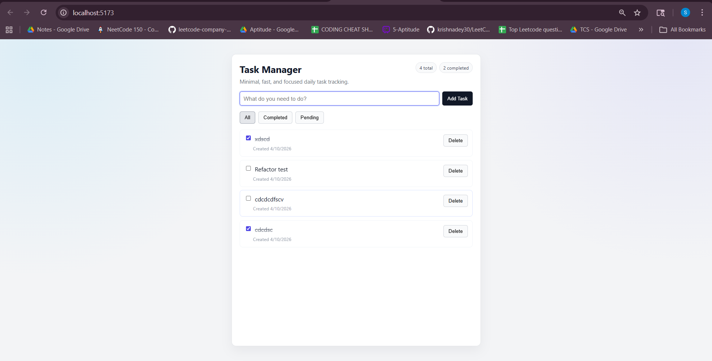

# Full Stack Task Manager

A polished full stack Task Manager that demonstrates practical engineering fundamentals: clean architecture, reliable CRUD flows, and user-focused feedback states.

## Why This Project Stands Out

- End-to-end feature ownership across frontend and backend
- Production-style backend structure with centralized error handling
- Consistent API contracts for predictable frontend integration
- Clean React architecture with reusable service and component layers
- Internship-ready documentation and project clarity

## Tech Stack

- Frontend: React (functional components + hooks), Vite
- Backend: Node.js, Express
- API Style: REST
- Storage: In-memory array (with frontend local cache)

## Demo

- Live Demo: Add your deployed link here
- Video Walkthrough: Add a short 1-2 minute walkthrough link here

## Screenshots

### Task Manager UI



Additional screenshots:

- Task list view: docs/screenshots/task-list.png
- Add task flow: docs/screenshots/add-task.png
- Filtered state: docs/screenshots/filter-state.png

## Key Features

### Backend

- REST API endpoints:
  - GET /tasks -> return all tasks
  - POST /tasks -> create a new task
  - PATCH /tasks/:id -> toggle completed status
  - DELETE /tasks/:id -> delete a task
- In-memory task storage (array)
- Task model:
  - id (string)
  - title (string)
  - completed (boolean)
  - createdAt (date)
- Validation:
  - title is required
- Consistent JSON response structure with success and error messages
- Modular architecture with routes, controllers, utilities, and middleware
- Centralized error handling for validation, malformed JSON, not found, and server errors

### Frontend

- Fetches and displays tasks from the backend
- Task creation form
- Toggle completion state
- Delete task
- User feedback states:
  - Loading state
  - Error messages
  - Empty state (No tasks available)
- Bonus functionality:
  - Filter: All, Completed, Pending
  - localStorage persistence for cached tasks

## Approach / Design Decisions

- Structure first: the backend is intentionally split into routes, controllers, data layer, middleware, and utilities for maintainability.
- Contract consistency: every API response follows a predictable shape, reducing UI edge-case complexity.
- Error reliability: custom app errors and a global error middleware keep handlers focused on business logic.
- Frontend clarity: API interaction is centralized in a service module to avoid duplicate request logic across components.
- Practical scope: in-memory storage keeps the app lightweight while still proving complete CRUD capability.

## Project Structure

```text
backend/
  server.js
  package.json
  src/
    app.js
    controllers/
      tasksController.js
    routes/
      tasksRoutes.js
    data/
      tasksStore.js
    middlewares/
      errorHandler.js
    utils/
      apiResponse.js
      AppError.js
      asyncHandler.js

frontend/
  package.json
  src/
    App.jsx
    App.css
    index.css
    components/
      TaskForm.jsx
      TaskList.jsx
      FilterBar.jsx
    services/
      taskService.js
```

## Prerequisites

- Node.js 18 or newer
- npm

## Installation

Install dependencies in both apps:

```bash
cd backend
npm install

cd ../frontend
npm install
```

## Run the App

### 1. Start backend

```bash
cd backend
npm run dev
```

Backend URL: http://localhost:5000

### 2. Start frontend

```bash
cd frontend
npm run dev
```

Frontend URL (default): http://localhost:5173

## API Reference

### GET /tasks

Response:

```json
{
  "success": true,
  "message": "Tasks fetched successfully",
  "data": []
}
```

### POST /tasks

Request body:

```json
{
  "title": "Buy groceries"
}
```

Success response:

```json
{
  "success": true,
  "message": "Task created successfully",
  "data": {
    "id": "...",
    "title": "Buy groceries",
    "completed": false,
    "createdAt": "2026-04-10T00:00:00.000Z"
  }
}
```

Validation error response:

```json
{
  "success": false,
  "message": "Validation error: title is required",
  "details": null
}
```

### PATCH /tasks/:id

Toggles completed status.

Success response:

```json
{
  "success": true,
  "message": "Task completion status updated",
  "data": {
    "id": "...",
    "title": "Buy groceries",
    "completed": true,
    "createdAt": "2026-04-10T00:00:00.000Z"
  }
}
```

### DELETE /tasks/:id

Success response:

```json
{
  "success": true,
  "message": "Task deleted successfully",
  "data": {
    "id": "...",
    "title": "Buy groceries",
    "completed": true,
    "createdAt": "2026-04-10T00:00:00.000Z"
  }
}
```

## Available Scripts

### Backend (backend/package.json)

- npm run dev -> run backend with nodemon
- npm run start -> run backend with node

### Frontend (frontend/package.json)

- npm run dev -> start Vite development server
- npm run build -> create production build
- npm run lint -> run ESLint

## Future Improvements

- Add database persistence (MongoDB or PostgreSQL)
- Add authentication and user-specific task lists
- Add unit and integration tests (Jest + Supertest + React Testing Library)
- Add pagination and search for large task collections
- Add Docker setup and CI pipeline for deployment readiness

## Notes

- Backend data is in-memory, so tasks reset when the backend restarts.
- Frontend localStorage acts as a client-side cache to improve perceived load performance.
